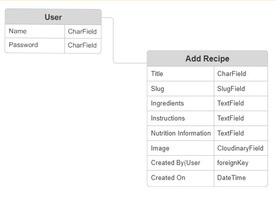
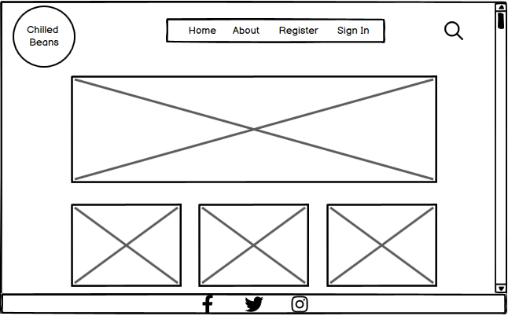
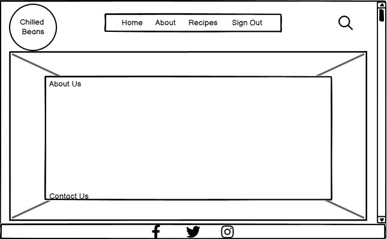
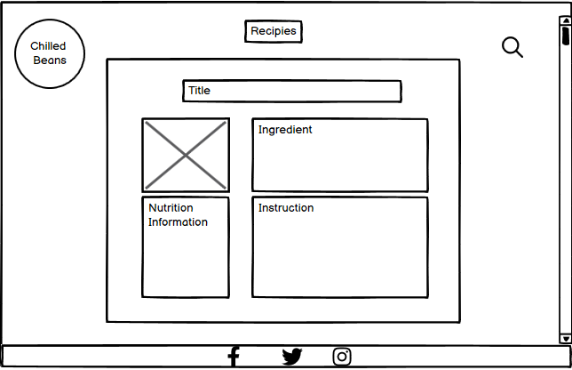
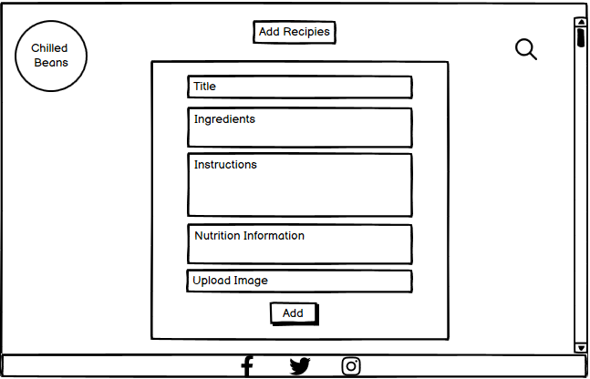
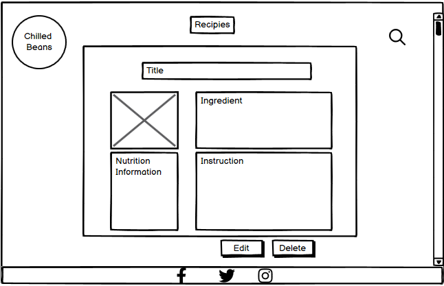

# Chilled Beans
### Full-Stack capstone project. Created during the Code Institute Full-Stack developer bootcamp.

![Images of chilled beans ]
## Introduction
Welcome to Chilled Beans, your ultimate destination for all things related to iced coffee! At Chilled Beans, we're passionate about bringing you the best recipes, tips, and tricks for making delicious and refreshing iced coffee drinks right in the comfort of your own home.

Whether you're a coffee aficionado looking to expand your repertoire of coffee creations or a beginner wanting to learn the basics, Chilled Beans has got you covered.

## Index
* [User Stories](#user-stories)
* [Workflow](#workflow)
   * [Agile Process](#agile-process)
   * [Models](#models)
* [Design](#design)
   * [Wireframe](#wireframe)
   * [colours](#colours)
   * [Branding](#branding)
* [Features](#features)
* [Technologies Used](#technologies-used)
* [Testing](#testing)
* [Bugs](#bugs)
* [Deployment](#deployment)
* [Credits](#credits)

## User Stories
### As a non logged user and logged user
|I want to.. | So that I can.. | Acceptance Criteria |
| ----------- | ----------- | ----------- |
| Find quick and easy iced coffee recipes | Make them during my morning routine | 1: user can easily navigate through the website to find what they're interested in 2: user can click on a post to read the full text |
| Consistent layout across all sections | Navigate the site easily without feeling disoriented | 1: ensure spacing between elements and sections is consistent across different pages  2: buttons and form elements should have a consistent design and layout |
| Responsive design | Open it from different screen sizes and devices | 1: elements should resize and adjust dynamically  2: add toggle navbar for small screens |
| Explore the nutrition facts of the recipes | Align it with my dietary preferences | 1: add nutrition facts to the recipe |
| Search the blog | Quickly find the recipe I want | 1: search bar in navigation area |
| Create an account | Share my favourite recipes | 1: user can create account  2: user can log in 3: user can log out |

### As a logged in user ( in addition to the previous stories )
|I want to.. | So that I can.. | Acceptance Criteria |
| ----------- | ----------- | ----------- |
| Add my recipes | Share my recipes with other users | 1: create add button 2:create form for adding recipes |
| Modify or delete my recipes | Keep my recipes updated | 1: add edit button 2: add delete button |

### As an owner
|I want to.. | So that I can.. | Acceptance Criteria |
| ----------- | ----------- | ----------- |
| Integrate social media links | Promote my blog | 1:add social media icons to the footer |
| Add contact email for feedback | Improve the website based on user feedback and emerging trends in the iced coffee community | 1: add contact email in about page |

### Out of scope for this release
| As a.. | I want to.. | So that I can.. | Acceptance Criteria |
|-------| ----------- | ----------- | ----------- |
| user | Add recipes to my favourite section | View my favourite recipes easily and quickly | 1: create add favourite button |
| User | Comment on the recipes | I ask anything I am not sure with | 1: add comments on the recipe |
| Owner | Monitor and moderate user recipes | Ensure the quality of the recipe |  1: admin can approve the recipes |

## Workflow
### Agile Methodology
I used Github projects to convert my user stories into actionable tasks. The acceptance criteria was very helpful to ensure all necessary tasks were completed.
<!-- image of github projects-->

### Models
In Chilled Beans I used the Django AllAuth User Model and created a custom Add Recipe Model.  This included the following fields:

## Design
### Wireframes and Features
The site will be fully responsive and accessible on mobile, tablet and desktop devices.

**All Users:**
- Have access to home page and about us page.
- Are able to view recipes
- Are able to use the search functionality

**Logged In Users:**
- Can add recipes
- Can edit and delete their own recipes

## Design Choices
###  Colours
I used [coolors.co] (https://https://coolors.co/000000-ffffff-a46f35-cd853f) to generate my colour palette:

I chose specific colors to ensure good readability and visual appeal on the website. I used black for the font color to provide high contrast against the white background, which enhances readability. Additionally, I opted for a light brown color for buttons to maintain a subtle and cohesive design, while using a darker brown shade for hover effects to create visual feedback and interactivity.

### Branding

I opted for a simplistic approach when designing the brand logo for the ice coffee blog, aiming to capture the essence of the product in a clear and straightforward manner. To create the logo, I utilized design.com to craft a visually appealing representation of the blog's theme and purpose.

## Future Features
Future features not implemented at this time include:
- Adding a "favorite" button, allowing users to mark recipes as favorites for quick and easy access.
- Implementing admin authorization for recipes to ensure the quality and reliability of the recipes shared on the platform.
- Allowing users to leave comments on recipes, fostering communication and enabling users to share feedback and suggestions for improvement.

## Technologies Used
- HTML
- CSS
- Bootstrap
- Python
- Django
- ElephantSQL Postgres Database
- Cloudinary - All user submitted recipe photos are uploaded to cloudinary
- GitPod development environment used
- GitHub used for version control and code hosting
- GitHub Projects used for Agile Methodology

## Testing
Results of manual testing:
[Testing](testing.md)

## Responsiveness
## Browser Compatibility

## Bugs

## Deployment

# Credits

- Code Institute I Think Therefore I Blog. 
- ChatGPT was used for troubleshooting, bug fixing and content generating.
- Logo by Design.com.
- photos and recipes from yourdreamcoffee.com:
https://yourdreamcoffee.com/
- very academy online videos are used to assist in creation of favourite button:
https://www.youtube.com/watch?v=H4QPHLmsZMU&t=31s
