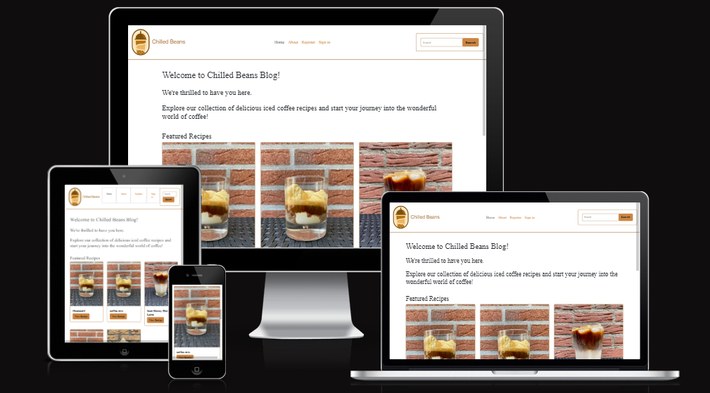
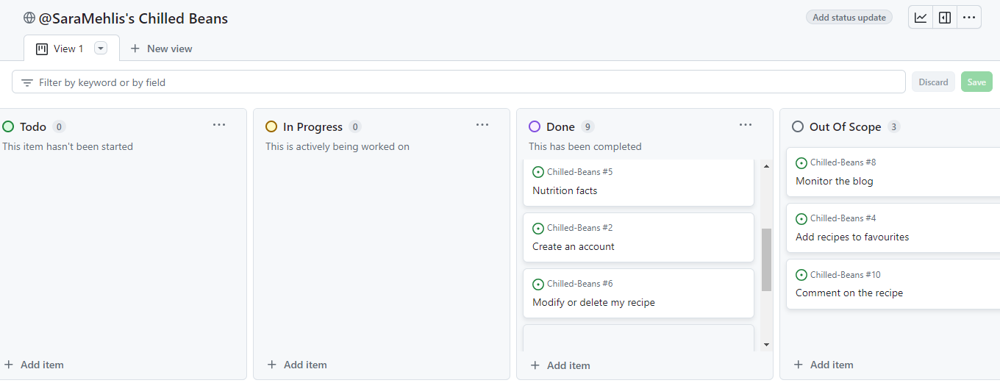
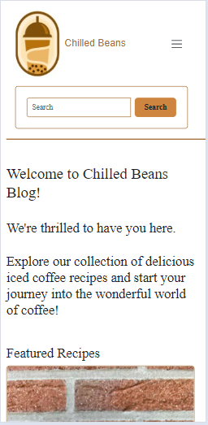
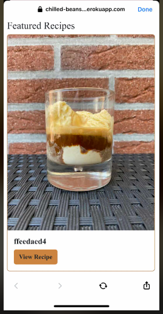
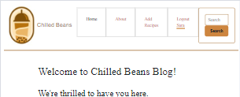
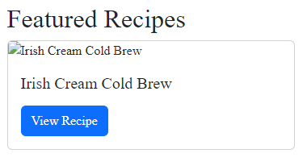

# [Chilled Beans](https://chilled-beans-b5ddfca96935.herokuapp.com/)
### Full-Stack capstone project. Created during the Code Institute Full-Stack developer bootcamp.



[Link to Chilled Beans website](https://chilled-beans-b5ddfca96935.herokuapp.com/)

## Introduction
Welcome to Chilled Beans, your ultimate destination for all things related to iced coffee! At Chilled Beans, we're passionate about bringing you the best recipes, tips, and tricks for making delicious and refreshing iced coffee drinks right in the comfort of your own home.

Whether you're a coffee aficionado looking to expand your repertoire of coffee creations or a beginner wanting to learn the basics, Chilled Beans has got you covered.


#### Goals: 
- An easy-to-use platform to store iced coffee recipes. 
- Provide nutrition information so users are aware of them because some recipres could have high calories. 
- Mobile-friendly access for convenience. 


#### Target Audience: 
Anyone who loves ice coffee and wants to try new recipes.


## Index
* [User Stories](#user-stories)
* [Workflow](#workflow)
   * [Agile Process](#agile-process)
   * [Models](#models)
* [Design](#design)
   * [Wireframe](#wireframe)
   * [colours](#colours)
   * [Branding](#branding)
* [Features](#features)
* [Technologies Used](#technologies-used)
* [Testing](#testing)
* [Bugs](#bugs)
* [Deployment](#deployment)
* [Credits](#credits)


## User Stories
### As a non logged user and logged user
|I want to.. | So that I can.. | Acceptance Criteria |
| ----------- | ----------- | ----------- |
| Find quick and easy iced coffee recipes | Make them during my morning routine | 1: user can easily navigate through the website to find what they're interested in 2: user can click on a post to read the full text |
| Consistent layout across all sections | Navigate the site easily without feeling disoriented | 1: ensure spacing between elements and sections is consistent across different pages  2: buttons and form elements should have a consistent design and layout |
| Responsive design | Open it from different screen sizes and devices | 1: elements should resize and adjust dynamically  2: add toggle navbar for small screens |
| Explore the nutrition facts of the recipes | Align it with my dietary preferences | 1: add nutrition facts to the recipe |
| Search the blog | Quickly find the recipe I want | 1: search bar in navigation area |
| Create an account | Share my favourite recipes | 1: user can create account  2: user can log in 3: user can log out |

### As a logged in user ( in addition to the previous stories )
|I want to.. | So that I can.. | Acceptance Criteria |
| ----------- | ----------- | ----------- |
| Add my recipes | Share my recipes with other users | 1: create add button 2:create form for adding recipes |
| Modify or delete my recipes | Keep my recipes updated | 1: add edit button 2: add delete button |


### As an owner
|I want to.. | So that I can.. | Acceptance Criteria |
| ----------- | ----------- | ----------- |
| Integrate social media links | Promote my blog | 1:add social media icons to the footer |
| Add contact email for feedback | Improve the website based on user feedback and emerging trends in the iced coffee community | 1: add contact email in about page |

### Out of scope for this release
| As a.. | I want to.. | So that I can.. | Acceptance Criteria |
|-------| ----------- | ----------- | ----------- |
| user | Add recipes to my favourite section | View my favourite recipes easily and quickly | 1: create add favourite button |
| User | Comment on the recipes | I ask anything I am not sure with | 1: add comments on the recipe |
| Owner | Monitor and moderate user recipes | Ensure the quality of the recipe |  1: admin can approve the recipes |


## Workflow
### Agile Methodology
I used Github projects to convert my user stories into actionable tasks. The acceptance criteria was very helpful to ensure all necessary tasks were completed.



### MoSCoW Prioritization

I was able to apply the MoSCow prioritization and labels to my user stories within the Issues tab.

- **Must Have**: guaranteed to be delivered (*max 60% of stories*)
- **Should Have**: adds significant value, but not vital (*the rest ~20% of stories*)
- **Could Have**: has small impact if left out (*20% of stories*)
- **Won't Have**: not a priority for this iteration

### Models
In Chilled Beans I used the Django AllAuth User Model and created a custom Add Recipe Model.  This included the following fields:


## Design
### Wireframes and Features
The site will be fully responsive and accessible on mobile, tablet and desktop devices.

**All Users:**
- Have access to home page and about us page.
- Are able to view recipes
- Are able to use the search functionality


**Logged In Users:**
- Can add recipes
- Can edit and delete their own recipes


## Design Choices
###  Colours
I used [coolors.co] (https://https://coolors.co/000000-ffffff-a46f35-cd853f) to generate my colour palette:

I chose specific colors to ensure good readability and visual appeal on the website. I used black for the font color to provide high contrast against the white background, which enhances readability. Additionally, I opted for a light brown color for buttons to maintain a subtle and cohesive design, while using a darker brown shade for hover effects to create visual feedback and interactivity.

### Branding


I opted for a simplistic approach when designing the brand logo for the ice coffee blog, aiming to capture the essence of the product in a clear and straightforward manner. To create the logo, I utilized design.com to craft a visually appealing representation of the blog's theme and purpose.


## Future Features
Future features not implemented at this time include:
- Adding a "favorite" button, allowing users to mark recipes as favorites for quick and easy access.
- Implementing admin authorization for recipes to ensure the quality and reliability of the recipes shared on the platform.
- Allowing users to leave comments on recipes, fostering communication and enabling users to share feedback and suggestions for improvement.


## Technologies Used
- HTML
- CSS
- Bootstrap
- Python
- Django
- ElephantSQL Postgres Database
This project uses [ElephantSQL](https://www.elephantsql.com) for the PostgreSQL Database.
To obtain your own Postgres Database, sign-up with your GitHub account, then follow these steps:
  - Click **Create New Instance** to start a new database.
  - Provide a name (this is commonly the name of the project: chilled-beans).
  - Select the **Tiny Turtle (Free)** plan.
  - You can leave the **Tags** blank.
  - Select the **Region** and **Data Center** closest to you.
  - Once created, click on the new database name, where you can view the database URL and Password.
- Cloudinary - All user submitted recipe photos are uploaded to cloudinary
This project uses the [Cloudinary API](https://cloudinary.com) to store media assets online, due to the fact that Heroku doesn't persist this type of data.
To obtain your own Cloudinary API key, create an account and log in.
  - For *Primary interest*, you can choose *Programmable Media for image and video API*.
  - Optional: *edit your assigned cloud name to something more memorable*.
  - On your Cloudinary Dashboard, you can copy your **API Environment Variable**.
  - Be sure to remove the `CLOUDINARY_URL=` as part of the API **value**; this is the **key**.
- GitPod development environment used
- GitHub used for version control and code hosting
- GitHub Projects used for Agile Methodology


## Testing
Results of manual testing:
[Testing](testing.md)


## Responsiveness
This website has been tested and is fully responsive on Desktop, Ipad and mobile devices.


## Browser Compatibility
The website has been tested and is being displayed as expected on Safari, Google Chrome and Firefox as well as on android and apple devices.

#### On Google Chrome:



#### On Apple device:




## Bugs



I've encountered a bug where boxes appear around navbar links on tablet-sized screens. I attempted to address this by reducing the padding around the navbar links, but unfortunately, the boxes continue to persist.



Since the image URL is not a static file, I should not use the  template tag. Instead I use {{image_url}}.(solved)


I added min-height: 100vh; to body to ensures the body fills at least the height of the viewport.(solved)


## Deployment
#### Heroku deployment
This project uses [Heroku](https://www.heroku.com), a platform as a service (PaaS) that enables developers to build, run, and operate applications entirely in the cloud.

Deployment steps are as follows, after account setup:

- Select **New** in the top-right corner of your Heroku Dashboard, and select **Create new app** from the dropdown menu.
- Your app name must be unique, and then choose a region closest to you (EU or USA), and finally, select **Create App**.
- From the new app **Settings**, click **Reveal Config Vars**, and set your environment variables.

| Key | Value |
| --- | --- |
| `CLOUDINARY_URL` | user's own value |
| `DATABASE_URL` | user's own value |
| `DISABLE_COLLECTSTATIC` | 1 (*this is temporary, and can be removed for the final deployment*) |
| `SECRET_KEY` | user's own value |

Heroku needs two additional files in order to deploy properly.

- requirements.txt
- Procfile

You can install this project's **requirements** (where applicable) using:

- `pip3 install -r requirements.txt`

If you have your own packages that have been installed, then the requirements file needs updated using:

- `pip3 freeze --local > requirements.txt`

The **Procfile** can be created with the following command:

- `echo web: gunicorn app_name.wsgi > Procfile`
- *replace **app_name** with the name of the primary Django app name; the folder where settings.py is located*

For Heroku deployment, I followed these steps to connect my own GitHub repository to the newly created app:
The project should now be connected and deployed to Heroku!

#### Local Deployment

This project can be cloned or forked in order to make a local copy on your own system.

For either method, you will need to install any applicable packages found within the *requirements.txt* file.

- `pip3 install -r requirements.txt`.

You will need to create a new file called `env.py` at the root-level,
and include the same environment variables listed above from the Heroku deployment steps.

Sample `env.py` file:

```python
import os

os.environ.setdefault("CLOUDINARY_URL", "user's own value")
os.environ.setdefault("DATABASE_URL", "user's own value")
os.environ.setdefault("SECRET_KEY", "user's own value")

# local environment only (do not include these in production/deployment!)
os.environ.setdefault("DEBUG", "True")
```
Once the project is cloned or forked, in order to run it locally, you'll need to follow these steps:
- Start the Django app: `python3 manage.py runserver`
- Stop the app once it's loaded: `CTRL+C` or `⌘+C` (Mac)
- Make any necessary migrations: `python3 manage.py makemigrations`
- Migrate the data to the database: `python3 manage.py migrate`
- Create a superuser: `python3 manage.py createsuperuser`
- Load fixtures (if applicable): `python3 manage.py loaddata file-name.json` (repeat for each file)
- Everything should be ready now, so run the Django app again: `python3 manage.py runserver`

#### Cloning
You can clone the repository by following these steps:
1. Go to the [GitHub repository](https://github.com/SaraMehlis/Chilled-Beans) 
2. Locate the Code button above the list of files and click it 
3. Select if you prefer to clone using HTTPS, SSH, or GitHub CLI and click the copy button to copy the URL to your clipboard
4. Open Git Bash or Terminal
5. Change the current working directory to the one where you want the cloned directory
6. In your IDE Terminal, type the following command to clone my repository:
	- `git clone https://github.com/SaraMehlis/Chilled-Beans`
7. Press Enter to create your local clone.

Alternatively, if using Gitpod, you can click below to create your own workspace using this repository.

[](https://gitpod.io/#https://github.com/SaraMehlis/Chilled-Beans)

#### Forking

By forking the GitHub Repository, we make a copy of the original repository on our GitHub account to view and/or make changes without affecting the original owner's repository.
You can fork this repository by using the following steps:

1. Log in to GitHub and locate the [GitHub Repository](https://github.com/SaraMehlis/Chilled-Beans)
2. At the top of the Repository (not top of page) just above the "Settings" Button on the menu, locate the "Fork" Button.
3. Once clicked, you should now have a copy of the original repository in your own GitHub account!


## Credits
- Code Institute I Think Therefore I Blog. 
- ChatGPT was used for troubleshooting, bug fixing and content generating.
- Logo by Design.com.
- photos and recipes from yourdreamcoffee.com:
https://yourdreamcoffee.com/
- very academy online videos are used to assist in creation of favourite button:
https://www.youtube.com/watch?v=H4QPHLmsZMU&t=31s
