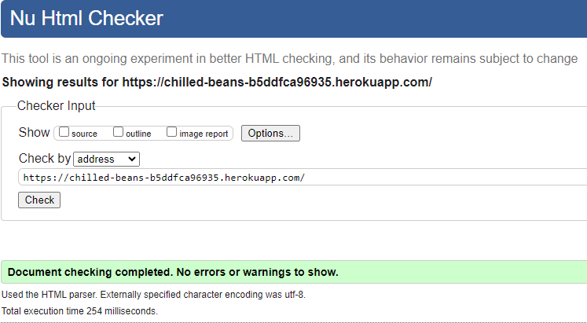
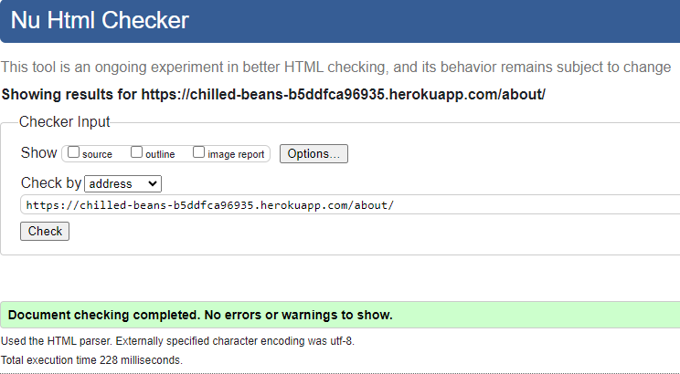
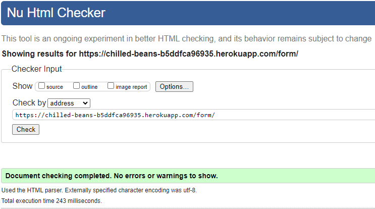
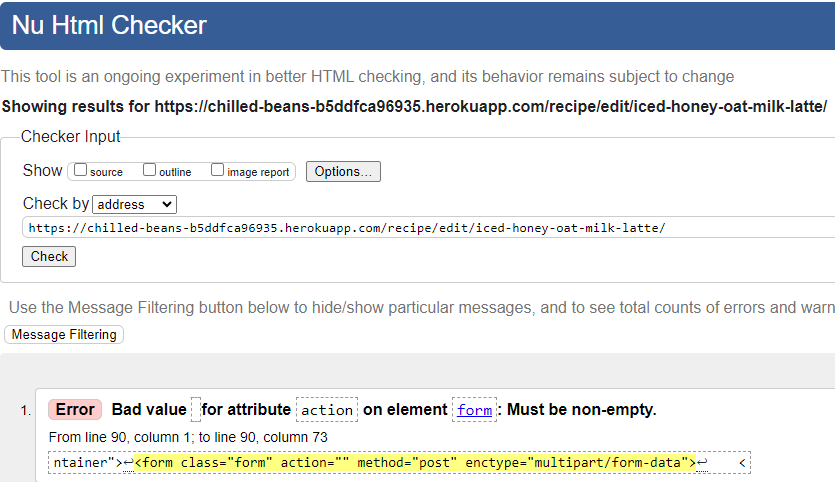
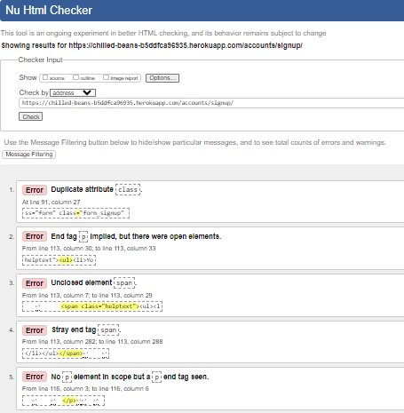
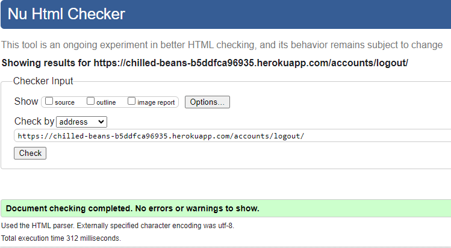

# Validation Testing

## HTML and CSS

I used the W3c validator on my HTML and CSS files.  Please see results below:

### HTML

| File | URL | Screenshot | Notes |
|--------|--------|--------|--------|
| Home | https://validator.w3.org/nu/?doc=https%3A%2F%2Fchilled-beans-b5ddfca96935.herokuapp.com%2F |  | Document checking completed. No errors or warnings to show |
| About | https://validator.w3.org/nu/?doc=https%3A%2F%2Fchilled-beans-b5ddfca96935.herokuapp.com%2Fabout%2F |  | Document checking completed. No errors or warnings to show |
| Add Recipe | https://validator.w3.org/nu/?doc=https%3A%2F%2Fchilled-beans-b5ddfca96935.herokuapp.com%2Fform%2F |  | Document checking completed. No errors or warnings to show |
| Edit page | https://validator.w3.org/nu/?doc=https%3A%2F%2Fchilled-beans-b5ddfca96935.herokuapp.com%2Frecipe%2Fedit%2Ficed-honey-oat-milk-latte%2F |  | The form will be submitted to the same view that renders it, leaving the action attribute empty (action="") is a common practice in Django |
| Register | https://validator.w3.org/nu/?doc=https%3A%2F%2Fchilled-beans-b5ddfca96935.herokuapp.com%2Faccounts%2Fsignup%2F |  | Error within AllAuth |
| Sign In | https://validator.w3.org/nu/?doc=https%3A%2F%2Fchilled-beans-b5ddfca96935.herokuapp.com%2Faccounts%2Flogin%2F |  | Document checking completed. No errors or warnings to show |
| sign Out | https://validator.w3.org/nu/?doc=https%3A%2F%2Fchilled-beans-b5ddfca96935.herokuapp.com%2Faccounts%2Flogout%2F |  | Document checking completed. No errors or warnings to show |   

