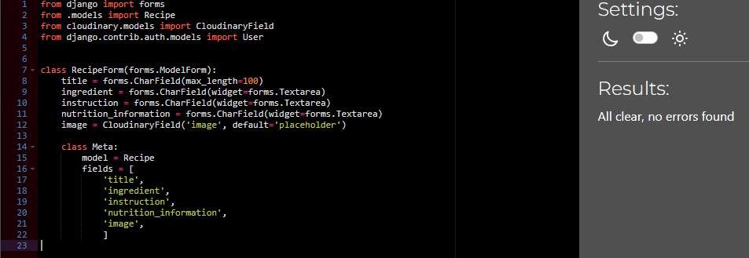

# Validation Testing

## HTML and CSS

I used the W3c validator on my HTML and CSS files.  Please see results below:

### HTML

| File | URL | Screenshot | Notes |
|--------|--------|--------|--------|
| Home | https://validator.w3.org/nu/?doc=https%3A%2F%2Fchilled-beans-b5ddfca96935.herokuapp.com%2F |  | Document checking completed. No errors or warnings to show |
| About | https://validator.w3.org/nu/?doc=https%3A%2F%2Fchilled-beans-b5ddfca96935.herokuapp.com%2Fabout%2F |  | Document checking completed. No errors or warnings to show |
| Add Recipe | https://validator.w3.org/nu/?doc=https%3A%2F%2Fchilled-beans-b5ddfca96935.herokuapp.com%2Fform%2F |  | Document checking completed. No errors or warnings to show |
| Edit page | https://validator.w3.org/nu/?doc=https%3A%2F%2Fchilled-beans-b5ddfca96935.herokuapp.com%2Frecipe%2Fedit%2Ficed-honey-oat-milk-latte%2F |  | The form will be submitted to the same view that renders it, leaving the action attribute empty (action="") is a common practice in Django |
| Confirm adding recipe page | https://validator.w3.org/nu/?doc=https%3A%2F%2Fchilled-beans-b5ddfca96935.herokuapp.com%2Fform%2F |  | Document checking completed. No errors or warnings to show |
| Confirm adding recipe page | https://validator.w3.org/nu/?doc=https%3A%2F%2Fchilled-beans-b5ddfca96935.herokuapp.com%2Frecipe%2Fdelete%2Fgggg32%2F |  | Document checking completed. No errors or warnings to show |
| Search Page | https://validator.w3.org/nu/?doc=https%3A%2F%2Fchilled-beans-b5ddfca96935.herokuapp.com%2Fsearch%2F%3Fq%3Dlatte |  | Document checking completed. No errors or warnings to show |
| Register | https://validator.w3.org/nu/?doc=https%3A%2F%2Fchilled-beans-b5ddfca96935.herokuapp.com%2Faccounts%2Fsignup%2F |  | Error within AllAuth |
| Sign In | https://validator.w3.org/nu/?doc=https%3A%2F%2Fchilled-beans-b5ddfca96935.herokuapp.com%2Faccounts%2Flogin%2F |  | Document checking completed. No errors or warnings to show |
| sign Out | https://validator.w3.org/nu/?doc=https%3A%2F%2Fchilled-beans-b5ddfca96935.herokuapp.com%2Faccounts%2Flogout%2F |  | Document checking completed. No errors or warnings to show |   

### CSS

| File |  URL | Screenshot | Notes |
|--------|--------|--------|--------|
| style.css | https://jigsaw.w3.org/css-validator/validator |  | No Error Found |

### PYTHON

I used the CI Python Linter https://pep8ci.herokuapp.com/# on all my .py files. Please see results below.
| File | Screenshot |
|--------|--------|
| my_project urls.py |  |
| my_project setting.py |  |
| admin.py |  |
| forms.py |  |
| models.py |  |
| blog urls.py |  |
| views.py |  |

Due to the nature of the code and the need to accommodate complex expressions, I encountered difficulties in complying with the PEP8 standards, particularly regarding line length. While adhering to the guidelines is important, in certain cases, maintaining readability and clarity took precedence.

### Manual Testing

#### Navigation bar links:
| Feature | Action | Expected outcome | Testing Performance | Pass/Fail |
|-------|-------|-------|-------|-------|
| Logo | Link to home page | Redirect to home | Clicked it | Pass |
| Home | Link to home page | Redirect to home | Clicked it | Pass |
| About | Link to About page | Redirect to about | Clicked it | Pass |
| Add recipe | Link to about page | Redirect to about | Clicked it | Pass |
| Register | Link to register page | Redirect to register page | Clicked it | Pass |
| Log In | Link to login page | Redirect to login page | Clicked it | Pass |
| Log Out | Link to logout page | Redirect to logout page | Clicked it | Pass |
| Search bar | Search recipes | Populate search results | Submit searches | Pass |

#### Footer:
| Feature | Action | Expected outcome | Testing Performance | Pass/Fail |
|-------|-------|-------|-------|-------|
| Footer | Clickable links to social media platforms | Social media links | Click it | Pass |

#### Recipes:
| Feature | Action | Expected outcome | Testing Performance | Pass/Fail |
|-------|-------|-------|-------|-------|
| View Recipe button | Button | Redirect to detailed recipe page | Click it | Pass |
| Add Recipe choose Image button | Button | Upload image | Click it | Pass |
| Add Recipe button | Button | Add recipe | Click it | Pass |
| Edit Button | Button | Redirect to recipe form | Click it | Pass |
| Delete Button | Button | Redirect to confirmatory page | Click it | Pass |
| Confirm delete page go home button | Button | Redirect to home page | Click it | Pass |

